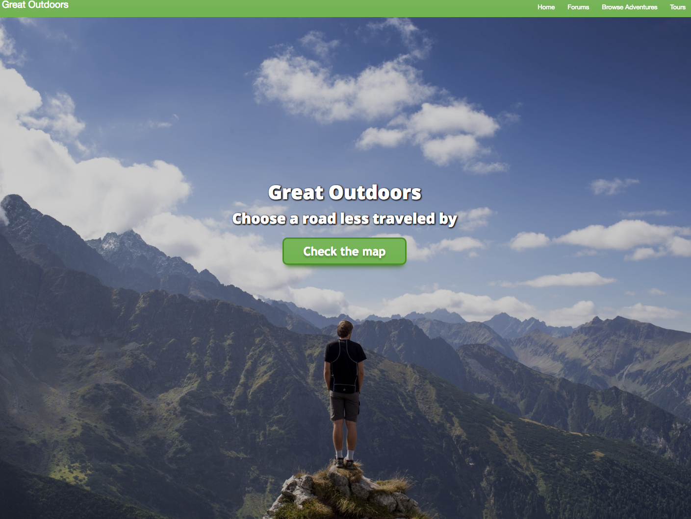

# The Great Outdoors

## Epicodus Drupal, Final Group Project

### By: Jordan Meier, Josh Overly, Mary Warrington, Jason Awbrey, Ben Ronda

### Description

The Great Outdoors is a website where users can search and filter for outdoor recreation adventures in the Portland area. There is also functionality for people to buy a subscription for 'guide' status so that they can add tours for people to purchase. Though it is not very built out yet, users can also discuss activities on a forum.

### Known Bugs

* Website is not very mobile responsive.
* There is a little bit of funkiness with the footer when you shrink the window size.
* User Order information and role status do not display on their profile yet.
* On first load on home page, when you click 'check the map' button, does a slight skip when scrolling.
* When a user logs in, the log in link in the footer does not disappear.

## Installation

To visit this site, go to: http://dev-great-outdoors.pantheonsite.io/

To install

* `git clone <repository-url>` this repository
* change into the new directory
* Open MAMP, click on preferences-> Web Server->Document Root
* Select the project directory.
* Start the Servers.
* In your browser, navigate to: http://localhost:8888/phpMyAdmin/
* Import the database that is located in the sites/all/db-backup. 
* Once the database is successfully downloaded, click on it on the far left of the screen, and find the tab at the top of the screen called 'Privileges'.
* Add the following user:
`User name: pantheon
 Host: localhost
 Password: 4da0e65abe8f41fd98f512a84d4b731b
`
* click 'go'

## Running / Development

* Visit the site at [http://localhost:8888](http://localhost:8888).
* To log into site maintenance account, use the username: admin and the password: admin.

### Technologies Used
* MAMP
* Drupal 7
* Pantheon
* Contrib Modules used:
  * Chaos Tools
  * AddToAny
  * Advanced Forum
  * Better Exposed Filters
  * CSS Injector
  * Fivestar
  * Flag
  * Gmap
  * Panels/Panilizer/Panels Everywhere
  * Paypal
  * Profile2
  * Rules
  * Superfish
  * Ubercart
  * Views

###Copyright & Licensing

Copyright (c) 2015 **Jordan Meier, Josh Overly, Mary Warrington, Jason Awbrey, Ben Ronda**

*This software is licensed under the MIT license.*

Permission is hereby granted, free of charge, to any person obtaining a copy
of this software and associated documentation files (the "Software"), to deal
in the Software without restriction, including without limitation the rights
to use, copy, modify, merge, publish, distribute, sublicense, and/or sell
copies of the Software, and to permit persons to whom the Software is
furnished to do so, subject to the following conditions:

The above copyright notice and this permission notice shall be included in
all copies or substantial portions of the Software.

THE SOFTWARE IS PROVIDED "AS IS", WITHOUT WARRANTY OF ANY KIND, EXPRESS OR
IMPLIED, INCLUDING BUT NOT LIMITED TO THE WARRANTIES OF MERCHANTABILITY,
FITNESS FOR A PARTICULAR PURPOSE AND NONINFRINGEMENT. IN NO EVENT SHALL THE
AUTHORS OR COPYRIGHT HOLDERS BE LIABLE FOR ANY CLAIM, DAMAGES OR OTHER
LIABILITY, WHETHER IN AN ACTION OF CONTRACT, TORT OR OTHERWISE, ARISING FROM,
OUT OF OR IN CONNECTION WITH THE SOFTWARE OR THE USE OR OTHER DEALINGS IN
THE SOFTWARE.
